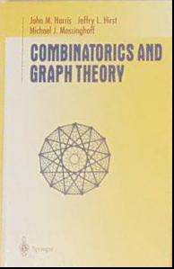
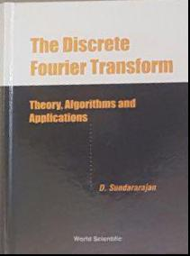
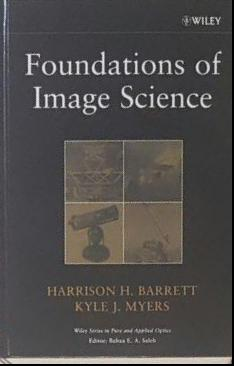

# Homography-and-Image-Warping

In some applications, we need to make changes to an image to make it clearer. for example, we may want to separate a part of an image from the others and do some changes to it. One of the practical examples of this application is cam scanner software.

Image1:

Results:

